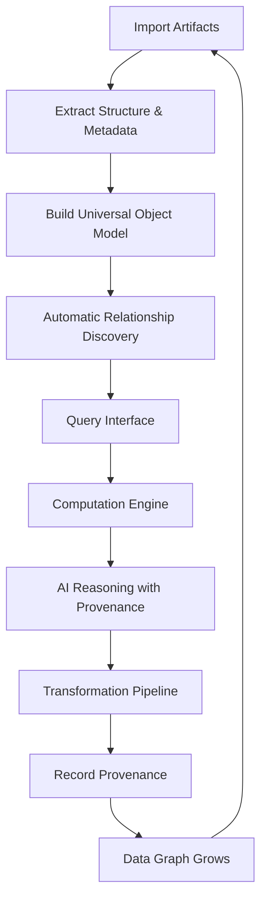

# DataOS — Universal Data Operating System

## Overview

DataOS is a universal, graph-based, computable data operating system that transforms fragmented information into a connected, explainable, and reproducible knowledge infrastructure for both humans and AI systems. It adheres to the principle that «Everything is data; every meaningful entity is an object; relationships form a graph; provenance explains origin; and capabilities operate on the resulting data system.»

**Core Philosophy (74 Engineering Rules):**
- Data is the source of truth — LLM-generated output is never treated as factual data
- The graph explicitly models how objects relate to one another
- AI is an operator — capable of querying, analyzing, transforming, summarizing, classifying, connecting, reasoning, generating, and automating, but never as an authoritative source of truth
- Computation must be deterministic and verifiable — against real data sources only
- Provenance is first-class — every derived result must be fully traceable to its inputs, transformations, and execution context
- Domain neutrality — core system remains free of domain-specific logic (no hardcoded student/analyst/researcher/business workflows)

**DataOS Core Loop:** INGEST → UNDERSTAND → STRUCTURE → CONNECT → QUERY → COMPUTE → REASON → TRANSFORM → ACT → RECORD PROVENANCE → REPEAT

**Most Important Differentiator:** DataOS is not a chat system or file assistant. It is a persistent, computable, and explainable data graph system where all information becomes interconnected and continuously more valuable over time.

## Goals

1. **Establish the universal object model** — All entities conform to structure with id, type, schema, relations, provenance, permissions, timestamps, version, source, metadata, indexes
2. **Implement the relationship graph** — First-class graph with source, target, relation_type, metadata, confidence, provenance, created_at, updated_at
3. **Build the provenance system** — Full traceability from inputs through transformations to execution context
4. **Enable the computation engine** — Pluggable engines for SQL, Python, DataFrame operations, statistical analysis
5. **Provide unified querying** — Across files, databases, APIs, data warehouses, object storage
6. **Support natural language querying** — "Show all objects related to this dataset," "What changed between these files," "Which datasets support this analysis?"
7. **Implement the AI agent layer** — Operates strictly through DataOS APIs with controlled capabilities and permission-controlled actions
8. **Ensure domain neutrality** — Core system free of domain-specific workflows; all specialized workflows emerge from primitives
9. **Achieve reproducibility** — All analyses reproducible with inputs, code, environment, and data versions
10. **Maintain portability** — Full portability of data, models, and workflows; no vendor lock-in

## Core User Flow

1. **Import** — User imports artifacts (PDFs, CSVs, videos, notebooks, documents)
2. **Extract** — System preserves original artifacts, extracts structure and metadata
3. **Structure** — System builds universal object model entries with schema validation
4. **Connect** — Automatic relationship discovery (structural matching, semantic matching, content-based matching, code analysis, git-based relationships)
5. **Query** — User queries via natural language or unified query interface
6. **Compute** — Computation engine executes against real data (SQL, Python, statistical analysis)
7. **Reason** — AI systems reason over results with full provenance grounding
8. **Transform** — Transformation pipelines apply (PDF → text → concepts → graph, CSV → profiling → analysis → insights)
9. **Record Provenance** — Full lineage recorded: inputs, transformations, execution context, tools/models used, parameters, timestamps, versions
10. **Repeat** — System returns to ingest state, data graph continues to grow in value

## Features

### Core Capabilities (per 74 Engineering Rules)

**Object Model:** All entities conform to universal object structure with id, type, schema, relations, provenance, permissions, timestamps, version, source, metadata, indexes.

**Relationship Graph:** First-class graph with extensible relationship types, confidence scores, and provenance. Supports multi-hop traversal, dependency analysis, impact analysis, and connectivity queries.

**Provenance System:** Every derived object includes complete provenance: inputs, transformations, execution context, tools/models used, parameters, timestamps, versions. Supports full provenance traversal answering: "Where did this result originate?" "What inputs contributed?" "What downstream artifacts depend on it?"

**Computation Engine:** Pluggable engines — SQL execution, Python execution, DataFrame operations, statistical analysis. Supports DuckDB and external systems. All computation deterministic and verifiable against real data.

**Query Engine:** Unified query interface across files, databases, APIs, data warehouses, object storage. All queries preserve: query text, inputs, execution metadata, outputs, provenance.

**Natural Language Querying:** Support queries like "Show all objects related to this dataset," "What changed between these files," "Which datasets support this analysis." All responses grounded in actual execution results.

**AI Agent Layer:** Agents operate through DataOS APIs with controlled capabilities: search, read, write, query and compute, transform and analyze, create and modify objects, execute code and workflows, call external APIs. All actions permission-controlled.

**Agent Permissions:** Fine-grained access control: read-only/read-write, object-level and collection-level permissions, operation-level restrictions, time-bound access, approval-based execution.

**Agent Execution Traces:** All agent activity fully auditable: inputs and goals, tools used, queries executed, objects accessed or modified, outputs and errors, timestamps.

**Multi-Agent Architecture:** Composable specialized agents: research agents, analysis agents, coding agents, data quality agents, automation agents. Agents are configurations, not core system primitives.

**Workflow Engine:** trigger → conditions → actions → outputs. Triggers: data changes, schema updates, scheduled events, user actions, system events.

**Transformation Pipeline:** Generic chains: PDF → text → concepts → graph; CSV → profiling → analysis → insights; Video → transcript → summary → concepts.

**Search System:** Hybrid search across full-text, metadata, semantic embeddings, graph traversal, structured queries.

**Data Profiling Engine:** Real computed metrics from actual data — row/column counts, null ratios, uniqueness and cardinality, statistical distributions, descriptive statistics, correlations, outlier detection.

**Data Quality Engine:** Reusable validation mechanisms: schema validation, type enforcement, range and regex checks, referential integrity, freshness checks, drift detection, anomaly detection. All quality results stored as first-class DataOS objects.

**Schema Evolution:** Track schema changes over time — additions/removals, type changes, renames, constraint modifications. Maintain dependency awareness: schema change → affected datasets → affected queries → affected reports.

**Semantic Layer:** User-defined abstraction layer — names and synonyms, definitions and descriptions, units and formulas, business meanings, semantic tags.

**Versioning:** All critical entities versioned — objects, schemas, graph states, analyses, workflows, agents.

**Data Diff Engine:** Semantic diffs across data, schemas, documents, code, analyses.

**Temporal Data Model:** Time-aware queries — event time, ingestion time, validity time, modification time.

**Local-First Architecture:** Support local-first operation, self-hosting, cloud deployment, hybrid configurations.

**Synchronization:** Secure, incremental synchronization with conflict detection, conflict resolution, offline operation, encrypted transfer.

**Storage Abstraction:** Pluggable storage backends — local filesystem, object storage (S3, GCS, Azure), databases.

**Import System:** Ingestion from files and folders, archives, databases, APIs, Git repositories. Preserves metadata, structure, and provenance.

**Export System:** JSON, CSV, Parquet, graph formats, SQL exports. Users retain full ownership of their data.

**API-First Architecture:** All functionality exposed via APIs — objects, graph, queries, agents, workflows, provenance.

**Event System:** System-wide event bus — object lifecycle events, schema changes, query execution, workflow execution.

**Plugin Architecture:** Extensibility via plugins for object types, connectors, AI providers, storage systems, workflow actions.

**Connector System:** Standardized external integrations — databases, APIs, file systems, cloud services.

**Data Catalog:** Automatically maintained catalog of all data assets — sources, datasets, tables, files, relationships, quality metrics.

**Usage Tracking:** Track how data consumed across queries, analyses, reports, agents.

**Impact Analysis:** Determine downstream effects of changes — broken dependencies, affected workflows, impacted reports.

**Data Health System:** Measure system health using real metrics — freshness, quality, integrity, pipeline status.

**Observability:** OpenTelemetry-compatible — logs, metrics, traces.

**Security:** Enterprise-grade — authentication and authorization, encryption, audit logging, role-based access control.

**Privacy:** Support local-only data, encrypted storage and sync, selective sharing, private execution contexts.

**AI Provider Abstraction:** Interchangeable AI providers — local models, OpenAI-compatible APIs, custom inference systems.

**Embedding Abstraction:** Embeddings replaceable, versioned, recomputable — not the source of truth.

**Knowledge Extraction:** Extract structured knowledge from unstructured data — entities, concepts, claims, relationships.

**Evidence System:** Evidence precisely grounded to files, rows, cells, timestamps, code lines.

**AI Answer Grounding:** All AI outputs include claims, evidence, computations, source references. No unsupported assertions allowed.

**Statistical Intelligence:** Verified statistical capabilities — hypothesis testing, regression, clustering, time-series analysis.

**Reproducible Analysis:** All analyses reproducible with inputs, code, environment, and data versions.

**Notebook Integration:** Notebooks treated as structured, executable objects with full lineage tracking.

**Code Intelligence:** Analyze code to extract dependencies, data usage, execution flows.

**Media Intelligence:** Extract structured information from media with timestamp-level provenance.

**Document Intelligence:** Parse document structure while preserving positional references.

**Universal Object Actions:** Objects expose dynamic capabilities — read, query, transform, analyze, execute, summarize, document.

**Graph Algorithms:** Standard graph operations — traversal, clustering, centrality, pathfinding.

**Recommendations:** Explainable recommendations with confidence and evidence.

**Duplicate Detection:** Detect duplicates without automatic deletion; preserve provenance.

**Conflict Resolution:** Represent conflicting data explicitly rather than overwriting it.

**Data Contracts:** Define enforceable expectations for data quality and structure.

**Resource Governance:** Enforce quotas and limits across system operations.

**Caching:** Intelligent, dependency-aware caching.

**Federation:** Multi-instance DataOS interoperability.

**Sharing Model:** Controlled sharing of objects and graphs.

**Interoperability:** Adopt open standards wherever possible.

## Core User Flow (Detailed)

## Scope

### In Scope

- Universal object model implementation
- Relationship graph with all relationship types
- Provenance tracking system full lifecycle
- Computation engine with pluggable engines
- Unified query interface (natural language + structured)
- AI agent layer with permission controls
- Multi-agent architecture compositions
- Workflow engine with trigger/condition/action/outputs
- Transformation pipelines (generic chains)
- Hybrid search system (full-text, metadata, semantic, graph, structured)
- Data profiling engine (real computed metrics from actual data)
- Data quality engine (reusable validation mechanisms)
- Schema evolution with dependency awareness
- Semantic layer (user-defined names, synonyms, definitions, units, formulas, tags)
- Versioning of all critical entities
- Data diff engine (semantic diffs)
- Temporal data model (event, ingestion, validity, modification time)
- Local-first architecture (local-first, self-hosting, cloud, hybrid)
- Synchronization (secure incremental with conflict detection/resolution)
- Storage abstraction (pluggable backends: local, S3, GCS, Azure, databases)
- Import system (files, folders, archives, databases, APIs, Git repos)
- Export system (JSON, CSV, Parquet, graph formats, SQL exports)
- API-first architecture (all functionality via APIs)
- Event system (system-wide event bus)
- Plugin architecture ( extensibility via plugins)
- Connector system (standardized external integrations)
- Data catalog (automated catalog of all data assets)
- Usage tracking (how data consumed across queries/analyses/reports/agents)
- Impact analysis (downstream effects of changes)
- Data health system (freshness, quality, integrity, pipeline status metrics)
- Observability (OpenTelemetry-compatible: logs, metrics, traces)
- Security (auth, authorization, encryption, audit logging, RBAC)
- Privacy (local-only data, encrypted storage/sync, selective sharing, private execution)
- AI provider abstraction (interchangeable providers)
- Embedding abstraction (replaceable, versioned, recomputable)
- Knowledge extraction (entities, concepts, claims, relationships from unstructured)
- Evidence system (evidence grounded to files, rows, cells, timestamps, code lines)
- AI answer grounding (all outputs include claims, evidence, computations, source references)
- Statistical intelligence (hypothesis testing, regression, clustering, time-series)
- Reproducible analysis (with inputs, code, environment, data versions)
- Notebook integration (notebooks as structured executable objects with lineage)
- Code intelligence (analyze code for dependencies, data usage, execution flows)
- Media intelligence (structured info from media with timestamp-level provenance)
- Document intelligence (parse structure preserving positional references)
- Universal object actions (dynamic capabilities on objects)
- Graph algorithms (traversal, clustering, centrality, pathfinding)
- Recommendations (explainable with confidence and evidence)
- Duplicate detection (without automatic deletion, preserve provenance)
- Conflict resolution (represent conflicting data explicitly)
- Data contracts (enforceable quality and structure expectations)
- Resource governance (quotas and limits across operations)
- Caching (dependency-aware caching)
- Federation (multi-instance interoperability)
- Sharing model (controlled sharing of objects and graphs)
- Interoperability (open standards adoption)

### Out of Scope

- Hardcoded domain-specific workflows (student, analyst, researcher, business)
- Chat system or file assistant
- Any system treating LLM output as factual data
- Fabricated data or results
- Hidden provenance or lineage
- Silent modification of source data
- Vendor lock-in or proprietary systems
- Domain-embedded workflows that cannot be composed from primitives

## Success Criteria

1. **Universal Object Model** — System accepts and validates objects with full structure (id, type, schema, relations, provenance, permissions, timestamps, version, source, metadata, indexes); 100% of core object types operational

2. **Relationship Graph** — System maintains first-class graph with source, target, relation_type, metadata, confidence, provenance, created_at, updated_at; all relationship types extensible; multi-hop traversal functional

3. **Provenance System** — Every derived result fully traceable to inputs, transformations, execution context; provenance traversal answers "where from," "what inputs," "what depends"; 100% of provenance-able operations recorded

4. **Computation Engine** — All arithmetic, statistics, SQL execution, Python execution, data transformation, aggregation, comparison computed against real data sources; zero fabricated results; deterministic and verifiable

5. **Natural Language Querying** — "Show all objects related to this dataset," "What changed between these files," "Which datasets support this analysis" all produce correct results grounded in actual execution

6. **AI Agent Layer** — All agents operate through DataOS APIs; all actions permission-controlled; execution traces fully auditable; no agent operates outside API capabilities

7. **Domain Neutrality** — Core system free of hardcoded student/analyst/researcher/business workflows; all specialized workflows composed from general-purpose primitives; verified via engineering rule audit

8. **Reproducibility** — All analyses reproducible with inputs, code, environment, and data versions; deterministic execution where possible; mlflow/model versioning functional

9. **Portability** — Full portability of data, models, and workflows; no vendor lock-in; export (JSON, CSV, Parquet, graph formats, SQL) retains completeness

10. **Engineering Rule Compliance** — All 74 engineering rules represented in installed dependencies and architecture; audit passes with zero violations of: never fabricate data, always preserve lineage, maintain transparency, ensure reproducibility, support portability